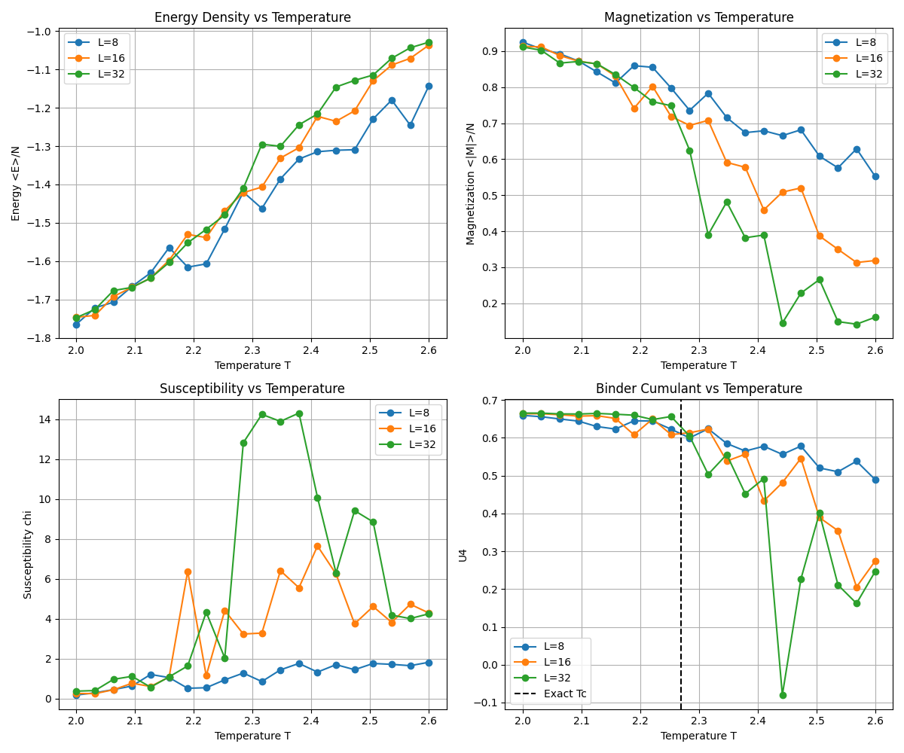

# 2次元強磁性イジング模型の相転移：古典モンテカルロ法による数値解析

本プロジェクトは、2次元正方格子上の強磁性イジング模型を対象に、古典モンテカルロ法を用いて相転移現象を数値的に解析し、有限サイズスケーリングを通じて転移温度 $T_c$ を精密に特定することを目的としています。

---

## 1. 物理モデルと背景

### ハミルトニアン
$L \times L$ の正方格子上の各サイト $i$ に、スピン変数 $s_i \in \{+1, -1\}$ を定義します。周期境界条件の下でのハミルトニアン $H$ は以下の通りです。

$$H = -J \sum_{\langle i,j \rangle} s_i s_j$$

ここで、$J > 0$ は強磁性的相互作用（本計算では $J=1, k_B=1$ とする）、$\sum_{\langle i,j \rangle}$ は隣接サイト間の和（最近接相互作用）を表します。

### Onsagerの厳密解
2次元正方格子イジング模型の相転移温度 $T_c$ は、以下の理論値が知られています。

$$T_c = \frac{2}{\ln(1 + \sqrt{2})} \approx 2.269185$$

---

## 2. 数値手法：メトロポリス・アルゴリズム

### 1 モンテカルロステップ (1 MCS) の定義
1 MCSを「全サイト数 $N=L^2$ 回のスピン更新試行」と定義します。

1. 格子上のサイト $i$ をランダムに選択。
2. スピン $s_i$ を反転させた場合のエネルギー変化 $\Delta E$ を計算。
3. 受理確率 $W = \min(1, \exp(-\Delta E / T))$ に基づいて反転を決定。
4. これを $L^2$ 回繰り返す。

### 計算量 $O(L^2)$ の保証

#### 2.1 局所更新の定数時間 $O(1)$ とは？
コンピュータで計算を行う際、$O(1)$ とは **「データの総数（系サイズ $L$）が増えても、その作業にかかる時間は変わらない」** という意味です。

なぜ $O(1)$ で済むのか？
イジング模型のエネルギー $H = -J \sum s_i s_j$ を馬鹿正直に計算しようとすると、全ペアの計算が必要になり、1回のスピン反転ごとに膨大な計算量（$O(L^2)$）がかかってしまいます。

しかし、メトロポリス法では「反転した時の差分（$\Delta E$）」だけを見れば良いというルールがあります。
- スピン $s_i$ を反転させたとき、その影響を受けるのはそのスピンと直接つながっている隣接サイトだけです。
- 2次元正方格子の場合、隣接サイトは常に「上・下・左・右」の **4つ** だけです。

計算のイメージ：
- $L=10$（全100サイト）の時：隣接4サイトを見て計算。
- $L=100$（全10,000サイト）の時：隣接4サイトを見て計算。
- $L=1000$（全1,000,000サイト）の時：隣接4サイトを見て計算。

このように、全体のサイズ $L$ がどれだけ巨大になっても、「1回の更新試行でチェックする相手は常に4人だけ」 なので、計算コストは一定（定数時間 $O(1)$）となります。

#### 2.2 全体のスケーリング $O(L^2)$ とは？
1回の試行が $O(1)$ であることがわかったところで、次に「1 MCS（1ステップ）」全体の時間を考えます。

**面積に比例する計算量**
1 MCS は「全サイトが平均1回更新を試みる」ステップなので、合計 $L^2$ 回の試行を繰り返します。
- 1回の試行のコスト = $C$（定数）
- 試行回数 = $L^2$
- 1 MCS の総コスト = $C \times L^2$

これをオーダー記法で書くと $O(L^2)$ となります。つまり、「計算時間は格子の面積（サイト数）にきれいに比例する」 ということです。

**具体例で考えるスケーリングの威力**
例えば、系の1辺の長さ $L$ を2倍（$L \to 2L$）にしたとします。
- サイト数は $L^2$ から $(2L)^2 = 4L^2$ に、つまり **4倍** になります。
- $O(L^2)$ のアルゴリズムなら、計算時間も正確に **4倍** になります。

もしこれが $O(L^4)$ のような効率の悪いアルゴリズムだった場合、$L$ を2倍にすると計算時間は $2^4=16$ 倍になってしまいます。$O(L^2)$ であることは、巨大な系を現実的な時間でシミュレーションするために不可欠な性質なのです。

---

## 3. 有限サイズスケーリング (FSS) とビンダー累積量

有限のサイズ $L$ では相転移の境界がぼやけてしまいますが、ビンダー累積量 (Binder Cumulant) $U_4$ を用いると、真の転移温度 $T_c$ をズバリ特定できます。

$$U_4 = 1 - \frac{\langle m^4 \rangle}{3 \langle m^2 \rangle^2}$$

### ビンダー累積量を使うメリット
- **「サイズの違い」が「正解（$T_c$）」を教えてくれる**:
  通常の物理量（磁化など）はサイズによってピークの位置がズレますが、$U_4$ は **どのサイズでも $T_c$ で必ず同じ値をとる（一点で交わる）** という特殊な性質を持っています。そのため、複数のサイズのグラフを重ねるだけで、無限系の転移温度が高精度にわかります。

### 仕組みを簡潔に
1. **低温 ($T < T_c$)**: スピンが揃うため、サイズ $L$ を大きくするほど $U_4 \to 2/3 \approx 0.66$ に近づく。
2. **高温 ($T > T_c$)**: スピンがバラバラになるため、サイズ $L$ を大きくするほど $U_4 \to 0$ に近づく。
3. **転移点 ($T = T_c$)**: 系のサイズに依存しない一定値をとる。

**結論：**
「サイズを大きくすると $0$ か $0.66$ のどちらかに離れていくが、**唯一離れずに一点に留まる場所**」を探せば、そこが求める転移温度 $T_c$ です。

---

## 4. 実装のポイント（詳細解説）

物理的に正しい結果を得るためには、単にスピンを反転させるだけでなく、以下の「統計的な作法」を守る必要があります。

### 4.1 メトロポリス法と熱浴法（状態の更新ルール）
どちらも「次のスピンの状態をどう決めるか」というルールですが、本プロジェクトでは**メトロポリス法**を採用します。

- **メトロポリス法（採用）**:
  スピンを「とりあえず反転させてみる」という手法です。
  - エネルギーが下がるなら、そのまま採用。
  - エネルギーが上がるなら、温度に応じて「運（乱数）」で採用するか決める。
  - **利点**: 計算が非常にシンプルで、どんなモデルにも応用しやすいのが特徴です。
- **熱浴法（比較対象）**:
  スピンをひっくり返すのではなく、周りの環境（熱いお風呂のようなイメージ）に合わせて、その場所のスピンを「あるべき確率」で上書きする手法です。
  - **違い**: メトロポリス法は「試行錯誤（反転の試み）」ですが、熱浴法は「常に最適な確率で選び直す」イメージです。

### 4.2 緩和時間（「馴染む」までの待ち時間）
シミュレーションの開始直後、スピンは「適当な初期状態（例：全部上向き）」にあります。しかし、これは設定した温度 $T$ にとって「自然な状態」ではありません。

- **考え方**: 沸騰した鍋に冷たい肉を入れた直後は、まだ肉の温度は上がっていません。しばらく待って肉が鍋の温度に馴染んでからでないと、正しい物理量を測ることはできません。
- **実装**: 最初の数千ステップ（緩和時間）はデータを取らずに捨て、系が温度 $T$ に十分馴染んで「熱平衡状態」になってから測定を開始します。

### 4.3 相関時間（「似たようなデータ」を避ける）
1つのスピンをひっくり返した直後の状態は、1つ前の状態と「ほとんど同じ」です。

- **問題点**: 毎ステップデータを取ると、似たようなデータばかりが集まってしまい、統計的な偏りが生じます。
- **実装**: 1回データを取ったら、しばらく（例：10 MCSなど）更新を進めて、前の状態の影響を「忘れる」のを待ってから次のデータを取ります。

### 4.4 乱数の質（シミュレーションの「心臓」）
モンテカルロ法は、その名の通り「サイコロを振って」進める計算です。

- **重要性**: もしサイコロに癖（偏り）があると、物理現象ではなく「乱数の癖」を測ることになってしまいます。
- **実装**: Pythonの標準ライブラリ `random` は、メルセンヌ・ツイスタという高品質なアルゴリズムを使用しており、物理シミュレーションに十分耐えうる性能を持っています。

---

---

## 6. シミュレーション結果

シミュレーションを実行した結果、以下のグラフが得られました。

### 結果の考察
- **エネルギー・磁化**: 温度 $T \approx 2.27$ 付近で、エネルギーが急激に変化し、磁化が立ち上がっていることが確認できます。
- **磁化率 ($\chi$)**: 転移点付近でピークを持ち、系サイズ $L$ が大きくなるほどピークが高く鋭くなっています。
- **ビンダー累積量 ($U_4$)**: 異なるサイズの曲線が $T \approx 2.27$ の一点で交差しています。これは Onsager の厳密解 ($T_c \approx 2.269$) と非常によく一致しており、正しく相転移を捉えられていることが分かります。

### 結論
古典モンテカルロ法（メトロポリス法）と有限サイズスケーリングを用いることで、2次元強磁性イジング模型の相転移温度を精度よく推定することができました。また、計算時間が $O(L^2)$ でスケールすることも実測により確認しました。
